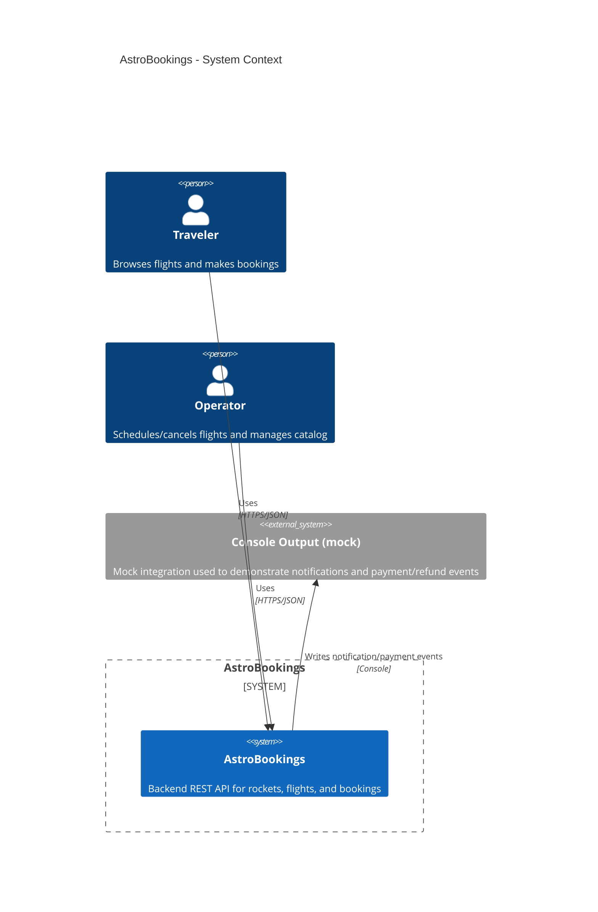

# AstroBookings P.R.D.

Product Requirements Document for AstroBookings

## Overview

**AstroBookings** is a RESTful backend API used in workshops to demonstrate clean architecture patterns (Presentation/Business/Persistence) by building a simplified space-travel booking domain (rockets, flights, bookings) with core business rules.

### Scope

- Provide HTTP endpoints to manage **Rockets**, **Flights**, and **Bookings**.
- Enforce business rules around capacity, pricing/discounts, and flight state transitions.
- Keep the solution **lightweight and easy to run locally** (training-oriented), favoring in-memory persistence and minimal dependencies.

### Goals

- Deliver a clear, teachable reference implementation of a layered REST API in .NET.
- Implement the core AstroBookings domain flows (create rocket, schedule flight, create booking, state changes).
- Provide predictable local developer experience (run/build + sample requests) suitable for workshops.

### Success criteria

- The API supports end-to-end flow: create rocket → schedule flight → create bookings until thresholds → observe correct flight state transitions.
- Domain validations return correct HTTP codes (e.g., 400 for invalid input, 409 for conflicts, 404 for missing resources).
- Project runs locally with `dotnet run` and requires no external infrastructure (DB, auth provider).

## Functional Requirements

### FR1 Rocket creation with validation

The system shall allow creating a `Rocket` with required `name`, `capacity` (1..10), and optional `range` (`LEO`, `MOON`, `MARS`) and optional `speed`.

### FR2 Rocket retrieval

The system shall allow listing all rockets and retrieving a rocket by id.

### FR3 Flight scheduling

The system shall allow creating a `Flight` linked to a rocket with:
- a launch date in the future
- a base price greater than 0
- a minimum passenger threshold (default 5)

On creation the flight state shall be `SCHEDULED`.

### FR4 Flight listing (future flights)

The system shall allow listing upcoming flights, with the ability to filter by flight state (at minimum to support “future/scheduled” views).

### FR5 Booking creation with eligibility checks

The system shall allow creating a `Booking` for a flight only when the flight is not `SOLD_OUT` and not `CANCELLED`, and only while capacity remains.

### FR6 Booking pricing with discounts

The system shall calculate `finalPrice` for a booking using the base price and apply **exactly one** discount with the following precedence:
1) Last seat → 0%
2) Missing 1 passenger to reach minimum → 30%
3) Otherwise → 10%

### FR7 Flight state transitions driven by bookings

The system shall automatically update flight state based on bookings:
- When the minimum passenger threshold is reached, flight becomes `CONFIRMED`.
- When rocket capacity is reached, flight becomes `SOLD_OUT`.

### FR8 Flight cancellation policy

The system shall support cancelling a flight (explicit action) resulting in `CANCELLED`.

Additionally, if a flight is within 1 week of launch and has not reached the minimum passenger threshold, the system shall cancel it (`CANCELLED`) and mark affected bookings for refund.

### FR9 Booking lookup by flight

The system shall allow querying bookings by flight id.

## Technical Requirements

### TR1 .NET REST API with minimal dependencies

The product shall be implemented as a .NET (targeting the current repo’s framework, e.g., `net9.0`) REST API using minimal dependencies appropriate for workshop use.

### TR2 Layered architecture boundaries

The codebase shall follow a 3-layer separation:
- Presentation (HTTP endpoints, DTO mapping, status codes)
- Business (domain rules and orchestration)
- Persistence (repositories; storage-agnostic interfaces)

### TR3 In-memory persistence

The system shall run without external infrastructure by default, using in-memory repositories for rockets, flights, and bookings.

### TR4 Consistent error handling and HTTP semantics

The API shall return consistent JSON responses and map validation/business errors to appropriate HTTP status codes (e.g., 400/404/409) and unexpected errors to 500 without leaking internal details.

### TR5 Observability for workshops

The system shall provide basic logging suitable for demos and debugging (request/operation level), and be runnable locally with clear configuration via `appsettings*.json`.

### TR6 Mocked notifications and payments

Notifications (e.g., “flight confirmed”, “flight cancelled”) and payment/refund actions shall be mocked during implementation; writing console messages is sufficient.

## Context diagram

> End of PRD for AstroBookings, last updated on 2025-12-15.
