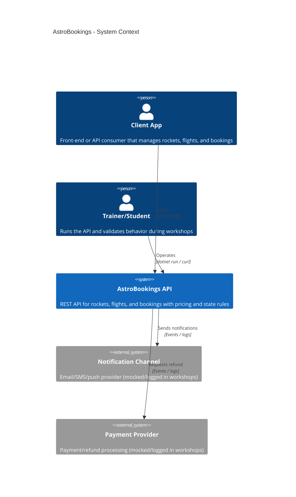

# AstroBookings P.R.D.

Product Requirements Document for AstroBookings

## Overview

**AstroBookings** is a RESTful backend API for a space-travel booking application used as a training/demo product. It manages **rockets**, **flights**, and **bookings**, enforcing capacity, pricing/discount rules, and flight state transitions.

### Goals

- Provide a clear API surface to create and query Rockets, Flights, and Bookings.
- Enforce business rules: capacity limits, minimum passengers, pricing/discount precedence, and valid state transitions.
- Keep the implementation workshop-friendly: minimal dependencies, no authentication, no database.

### Non-goals (Out of Scope)

- User authentication/authorization.
- Persistent storage (SQL/NoSQL), migrations, or multi-environment data management.
- Real payment processing and real notification delivery (may be simulated via logs/events).

### Context diagram

## Functional Requirements

### FR1 Rocket Management

The system must allow creating and querying Rockets.

- Create Rocket with validation:
  - `name` is required.
  - `capacity` is required and must be $\le 10$.
  - `speed` is optional.
  - `range` is optional and must be one of: `LEO`, `MOON`, `MARS`.
- List all Rockets.
- Get Rocket by id.

### FR2 Flight Creation and Validation

The system must allow creating Flights linked to a Rocket.

- Create Flight with:
  - `launchDate` must be in the future.
  - `basePrice` must be $> 0$.
  - `minimumPassengers` defaults to `5` when omitted.
- On creation, flight state must be set to `SCHEDULED`.

### FR3 Flight Querying (Future Flights)

The system must allow listing future flights and filtering by state.

- List only flights with `launchDate` in the future.
- Support filtering by flight state (e.g., `SCHEDULED`, `CONFIRMED`, `SOLD_OUT`).

### FR4 Booking Creation with Capacity and State Rules

The system must allow creating Bookings for a Flight with strict constraints.

- A booking includes passenger `name` and `email`.
- Booking can be created only if the flight is not `CANCELLED` and not `SOLD_OUT`.
- The system must never exceed the Rocket capacity for a flight.
- When the last seat is taken, the flight must transition to `SOLD_OUT`.

### FR5 Discount Calculation (Single Discount, With Precedence)

The system must calculate a final booking price from the flight `basePrice` using exactly one discount based on precedence:

1. **Last seat**: 0% discount.
2. **One passenger away from reaching minimum passengers**: 30% discount.
3. **Otherwise**: 10% discount.

The system must store the computed `finalPrice` on the Booking.

### FR6 Automatic Flight State Transitions

The system must automatically update flight state based on bookings and time.

- When the number of bookings reaches `minimumPassengers`, the flight transitions to `CONFIRMED` and a notification is triggered.
- When the number of bookings reaches Rocket capacity, the flight transitions to `SOLD_OUT`.
- When the flight is performed, the flight transitions to `DONE`.
- When the admin manually cancels a flight, it transitions to `CANCELLED`.
- No automatic transition to `CANCELLED` is required for this version (can be manual only).

### FR7 Booking Query by Flight

The system must allow querying bookings for a specific flight.

- List bookings by `flightId`.
- Returned bookings must include passenger information and pricing.

### FR8 Manual Flight Cancellation

The system must allow cancelling a flight.

- Cancelling a flight sets state to `CANCELLED`.
- Cancelling triggers notification and refund workflow for existing bookings.

## Technical Requirements

### TR1 Technology and API Style

- Implement as an HTTP JSON RESTful API.
- Use C# and .NET (current repo target: .NET 9 / `net9.0`).
- Prefer ASP.NET Core Minimal APIs.
- Use minimal external dependencies.

### TR2 Persistence (In-Memory)

- No database is required.
- Use in-memory repositories suitable for workshop demos.
- Repositories must be safe for concurrent access (e.g., thread-safe collections).

### TR3 Architecture and Design### TR4 Validation and Error Handling

- Validate inputs for create/update operations.
- Return appropriate HTTP status codes for validation errors and missing resources.
- Enforce state rules server-side (cannot book into `CANCELLED` / `SOLD_OUT`).

### TR4 Observability (Workshop-Friendly)

- Log key state transitions and notification/refund triggers.
- Notifications and payments may be implemented as abstractions with demo implementations (e.g., logging).

> End of PRD for AstroBookings, last updated on 2025-12-15.
