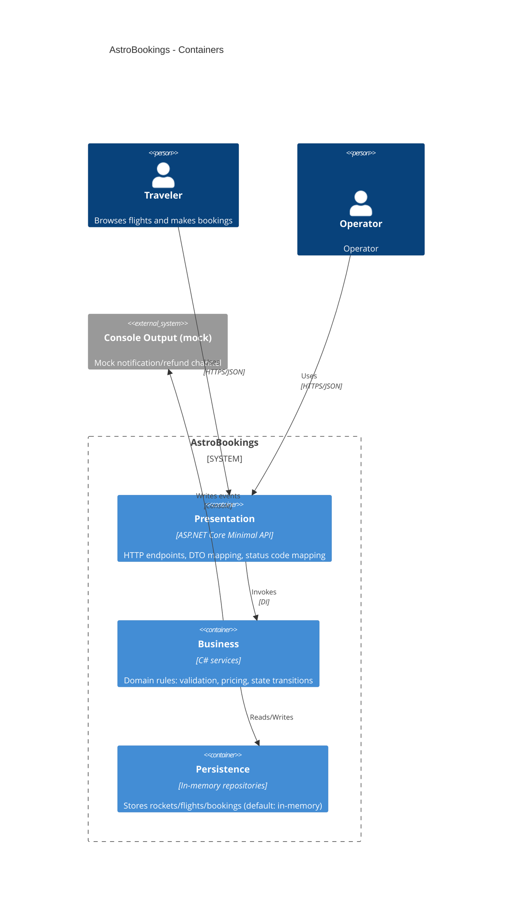

# AstroBookings STRUCTURE

Structure Document for AstroBookings

## Overview

**AstroBookings** is a workshop-oriented REST backend that demonstrates a clean layered architecture by implementing a simplified space-travel booking domain.

The PRD scope covers **Rockets**, **Flights**, and **Bookings** with deterministic, in-memory persistence and minimal dependencies so participants can run the full flow locally.

**Current implementation status (brownfield):** the repository currently implements the Rocket slice (create rocket) and the foundational layering (Presentation/Business/Persistence). Flights and bookings are not yet implemented and are listed below as **⚡ Proposed** additions.

## Technical Stack and Architecture Patterns

### Technical Stack

- **Runtime:** .NET 9 (`net9.0`), C# 12
- **Web:** ASP.NET Core Minimal APIs (`WebApplication`)
- **DI & configuration:** built-in dependency injection + `appsettings.json` / `appsettings.Development.json`
- **Logging/observability:** `Microsoft.Extensions.Logging` (console)
- **Persistence (default):** in-memory repositories (e.g., `ConcurrentDictionary`) to avoid external infrastructure

### Architecture Patterns

- **Layered architecture (3 layers):**
  - **Presentation**: HTTP endpoints, DTO mapping, and HTTP status mapping.
  - **Business**: domain rules and orchestration (validation, state transitions, pricing).
  - **Persistence**: repositories and storage abstractions.
- **Dependency direction:** Presentation depends on Business, Business depends on Persistence abstractions; Persistence has no dependency on Presentation.
- **Deterministic domain orchestration:** business services are responsible for enforcing PRD rules (capacity, thresholds, discount precedence, flight state transitions) and returning domain outcomes that Presentation maps to HTTP responses.

## Development Workflow

```bash
# Build + run
dotnet build
dotnet run

# Formatting (recommended)
dotnet format

# Tests (when added)
dotnet test
```

- Use short-lived branches (e.g., `feature/*`, `fix/*`) and merge via pull requests.
- Keep changes small and aligned with PRD rules; reviewers verify business rules and HTTP semantics.
- Prefer Conventional Commits for message consistency (`feat:`, `fix:`, `docs:`), using an issue number when applicable.

## Architecture

`Program.cs` bootstraps the Minimal API app, registers dependencies, and maps endpoints.

- **Presentation** defines endpoint mapping extensions (e.g., rockets) and converts request DTOs into calls to business services.
- **Business** performs validation and constructs domain models, then delegates to repositories.
- **Persistence** implements in-memory repositories for local-first execution.

### Folder Structure

Main folders and their purposes:

```
Redinet-Copilot_Net/
├── Program.cs                # App bootstrap: DI + endpoint mapping
├── appsettings*.json         # Environment-based configuration
├── lib/
│   ├── Presentation/         # Minimal API endpoints and HTTP concerns
│   ├── Business/             # Domain orchestration and policies
│   ├── Persistence/          # In-memory repositories (default)
│   ├── Dtos/                 # Request/response contracts
│   └── Models/               # Domain entities and enums
└── docs/                     # PRD and architecture docs
```

### Components diagram



## Development Infrastructure

- **Local execution:** `dotnet run` (no DB, no auth provider)
- **Configuration:** `appsettings.json` + environment override via `ASPNETCORE_ENVIRONMENT=Development`
- **Logging:** console logging via `Microsoft.Extensions.Logging` (also used for mocked notifications/payments/refunds)

## ⚡ Proposed (to satisfy remaining PRD scope)

- ⚡ Proposed: Add **Flight** and **Booking** endpoints in `lib/Presentation` with consistent error mapping (400/404/409/500) per TR4.
- ⚡ Proposed: Add `FlightService` and `BookingService` in `lib/Business` to implement FR3–FR9:
  - state machine: `SCHEDULED` → `CONFIRMED` (min threshold) → `SOLD_OUT` (capacity)
  - discount precedence rules for final price
  - explicit cancellation + automated cancellation within 1 week when threshold unmet
- ⚡ Proposed: Add in-memory repositories for flights and bookings in `lib/Persistence`.
- ⚡ Proposed: Introduce an `ITimeProvider` abstraction for deterministic tests and time-based cancellation policy.

> End of STRUCTURE document for AstroBookings, last updated on 2025-12-15.
