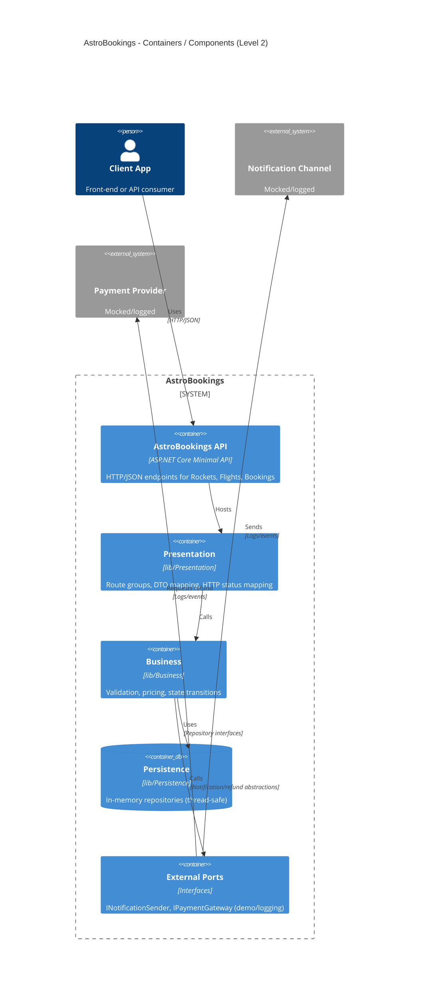

# AstroBookings STRUCTURE

Structure Document for AstroBookings

## Overview

**AstroBookings** is a layered (Presentation/Business/Persistence) Minimal API backend designed for workshop-friendly evolution: small, readable modules, minimal dependencies, deterministic behavior, and in-memory persistence.

The system exposes a RESTful HTTP/JSON API to manage **Rockets**, **Flights**, and **Bookings**, enforcing capacity, pricing/discount rules, and flight state transitions.

Implemented Rocket endpoints:

- `POST /rockets` creates a rocket.
- `GET /rockets` lists all rockets.
- `GET /rockets/{id}` retrieves a rocket by id.

Implemented Flight endpoints:

- `POST /flights` creates a flight.
- `GET /flights` lists only future flights (optional `?state={state}` filter).

Implemented Booking endpoints:

- `POST /flights/{flightId}/bookings` creates a booking for a flight.

## Architecture

### Architecture style

- **API style**: RESTful HTTP/JSON.
- **Application style**: ASP.NET Core **Minimal APIs** with feature-based endpoint mapping.
- **Structural pattern**: **3-layer architecture**:
  - **Presentation**: HTTP endpoints, DTO mapping, status code mapping.
  - **Business**: domain rules and orchestration (validation, pricing, state transitions).
  - **Persistence**: in-memory repositories (thread-safe), no HTTP/DTO knowledge.

### Layer responsibilities and rules

- **Dependency direction**: Presentation → Business → Persistence (abstractions).
- **Contracts**:
  - DTOs live in `lib/Dtos` (request/response).
  - Domain models live in `lib/Models`.
  - Persistence repositories live in `lib/Persistence`.
  - Repository abstractions live alongside persistence in `lib/Persistence` (e.g., `IRocketRepository`).
- **Error handling**:
  - Business should not throw for expected outcomes (validation, not found, conflicts). It should return explicit results.
  - Presentation maps Business outcomes to HTTP (`400/404/409`, etc.).
- **Deterministic time**:
  - Business logic should not call `DateTime.UtcNow` directly.
  - Use `TimeProvider` (or a small abstraction) injected via DI for time-based rules.

### Cross-cutting concerns

- **Logging**: use `ILogger<T>` with structured templates. Log state transitions and workflow triggers (notifications/refunds) at `Information`, validation/conflicts at `Warning`, unexpected failures at `Error`.
- **Configuration**: use `appsettings.json` + `appsettings.{Environment}.json` and the options pattern for strongly-typed settings.
- **Concurrency**: repositories must be safe for concurrent access (e.g., `ConcurrentDictionary` + atomic operations).

### Rockets (current shape)

- **Domain model**: `Rocket`
  - `Id` (string, assigned by repository; deterministic sequential IDs like `r0001`)
  - `Name` (required)
  - `Capacity` (required, `<= 10`)
  - `Speed` (optional)
  - `Range` (enum: `LEO`, `MOON`, `MARS`)
- **DTOs**
  - Create request: `RocketDto` (uses `range` string with default `LEO`)
  - Response: `RocketResponseDto` (includes optional `speed`)

### Folder Structure

Main folders and their purposes:

```
.
├── Program.cs                 # Composition root: DI registration + endpoint mapping
├── appsettings.json           # Baseline configuration
├── appsettings.Development.json
├── lib/
│   ├── Presentation/          # Minimal API endpoint maps (e.g., *Endpoints.cs)
│   ├── Business/              # Domain rules + orchestration services
│   ├── Persistence/           # In-memory repositories (thread-safe)
│   ├── Models/                # Domain entities + enums (Rocket/Flight/Booking)
│   └── Dtos/                  # Request/response DTOs
└── docs/                      # PRD + architecture docs
```

Notes:
- `Program.cs` stays small: builder/app creation, DI registration, and endpoint group mapping.
- Each feature gets a coherent set of files across layers (e.g., Rocket/Flight/Booking).

### Components diagram



## Development

### Technical Stack

- **Language**: C# (C# 12)
- **Runtime/Framework**: .NET 9 (`net9.0`), ASP.NET Core Minimal APIs
- **DI**: built-in `Microsoft.Extensions.DependencyInjection`
- **Logging**: `Microsoft.Extensions.Logging`
- **Config**: `Microsoft.Extensions.Configuration` + Options pattern
- **Persistence**: in-memory, thread-safe collections (e.g., `ConcurrentDictionary`)
- **Docs**: Markdown in `docs/` (PRD + STRUCTURE)

### Development Workflow

```bash
# Restore/build
dotnet build

# Run (uses launchSettings / default URLs)
dotnet run

# Run in Development (PowerShell)
$env:ASPNETCORE_ENVIRONMENT = 'Development'; dotnet run

# Format (when available)
dotnet format

# Tests (add when the repo includes them)
dotnet test
```

Workflow conventions:
- Keep `Program.cs` as the composition root; feature code lives in `lib/*`.
- Add endpoints as `Map{Feature}Endpoints` extension methods under `lib/Presentation`.
- Business services depend on repository interfaces (and time/port abstractions), not concrete implementations.
- Repositories are deterministic (IDs) and safe for concurrent access.
- New dependencies require an explicit decision (keep the workshop surface minimal).

> End of STRUCTURE document for AstroBookings, last updated on 2025-12-16.
